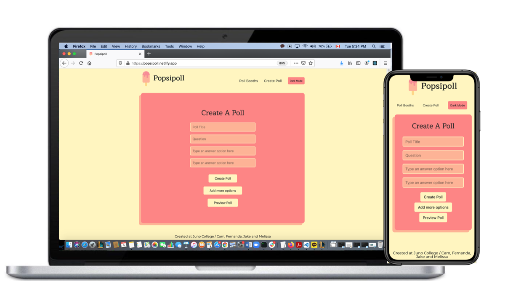
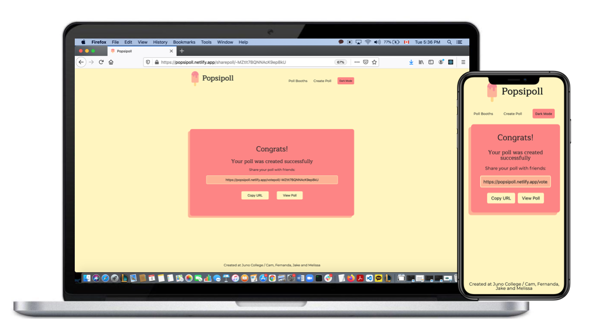
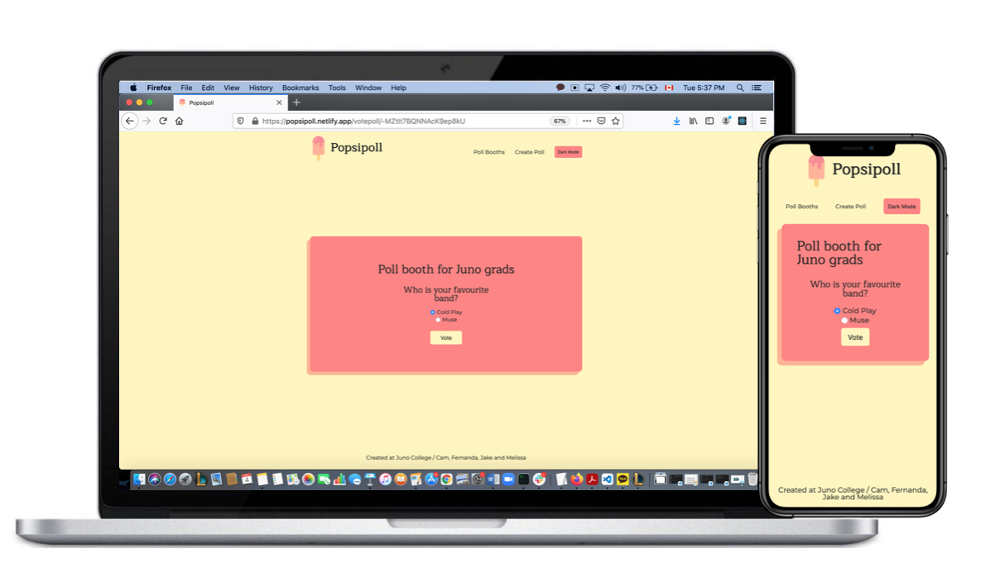
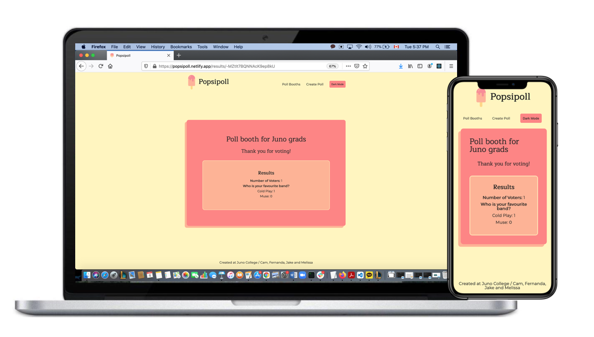

<h1 align="center">Popsipoll</h1>

<strong>Create a survey and let your participants vote anonymously.</strong>

 

<h2>About</h2>
Anonymous poll web application built with React, SASS, and Firebase. 
LIVE DEMO :https://popsipoll.netlify.app/
 

<h2>Purpose</h2>
This application will provide several functions to allow users create a poll booth, share the booth url, and vote for the poll.
 

<h2>Key features</h2>
<ul>
<li>Create Page</li>
<li>Share Page</li>
<li>Vote Page</li>
<li>Result Page</li>
<li>View Page</li>
<li>Dark Mode</li>
</ul>
 

<h2>Design and requirements</h2>

<h2>Create Page</h2>

1. Poll title input box: User can name the poll booth. 

2. Question input box: User can type the question for the poll. 

3. Answer input boxes: User can type the answer options for the question. 

4. Create Poll button: Submit button to create a poll booth. 

5. Add More Options button: Click button to add more answer options. 

6. Preview button: Submit button to preview a poll booth before submitting. 

 

<h2>Share Page</h2>

1. URL box: unique url for the poll booth just made 

2. Copy URL button: Click button to allow user can easily copy the unique URL in the box above.

3. Vote button: Submit button to send user to the poll booth page to vote.

 

<h2>Vote Page</h2>

1. Poll info display: user can see poll title, question, and answer options. 

2. Vote button: Submit button to finalize the vote.

 

<h2>Result Page</h2>

1. Result for the poll display: user can see how many people voted for each answer.

 

<h2>View Page</h2>

1. User can see other poll booth created. 

 

<h2>Dark Mode</h2>

1. Darl/Light button: user can change the colour theme as they wish. 

 

<h2>Copyright</h2>
This project is licensed under the terms of the MIT license.
